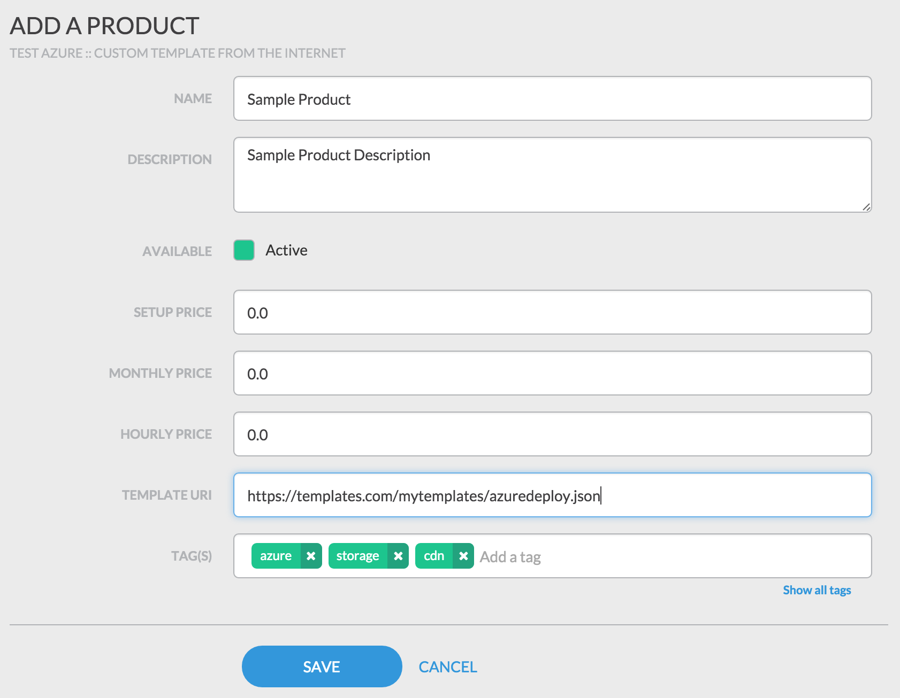
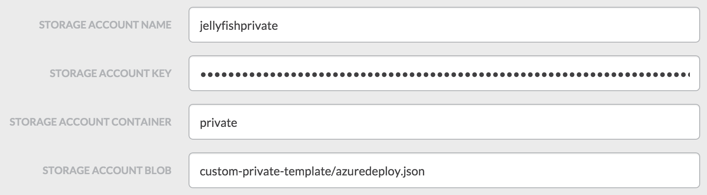

# jellyfish-azure

## Setup

The Jellyfish Azure module utilizes Azure's Resource Manager interface to manage resources such as Storage Accounts, Virtual Machines, and Virtual Networks.  To perform this work, an Azure Subscription is used to allow an external application to manage Azure Resources.

There will be 4 values to capture in this process. They will be used to connect Jellyfish to Azure:
- Subscription ID
- Tenant ID
- Client ID
- Client Secret

The first step us downloading and installing the [Azure CLI](https://azure.microsoft.com/en-us/documentation/articles/xplat-cli/).  Once the CLI is installed, the first step is getting the Subscription and Tenant IDs used when connecting Jellyfish to your Azure account.

```
$ azure account list 

info:    Executing command account list
data:    Name                             Id                                    Current  State
data:    -------------------------------  ------------------------------------  -------  -----
data:    Your subscription name           xxxxxxxx-xxxx-xxxx-xxxx-xxxxxxxxxxxx  true     n/a  
info:    account list command OK
```

Find the subscription you wish to use with Jellyfish and write down the **Subscription ID**.  Now use the Subscription ID to find the Tenant ID by requesting the details of the Subscription.

```
$ azure account show xxxxxxxx-xxxx-xxxx-xxxx-xxxxxxxxxxxx

info:    Executing command account show
data:    Name                        : Your subscription name
data:    ID                          : xxxxxxxx-xxxx-xxxx-xxxx-xxxxxxxxxxxx
data:    State                       : n/a
data:    Tenant ID                   : xxxxxxxx-xxxx-xxxx-xxxx-xxxxxxxxxxxx
data:    Is Default                  : true
data:    Environment                 : AzureCloud
data:    Has Certificate             : No
data:    Has Access Token            : Yes
data:    User name                   : user@domain.onmicrosoft.com
data:    
info:    account show command OK
```

Write down the **Tenant ID** for later use.  Next create the Active Directory application and service principal used to manage access to the Azure API. Choose a password that will be your client key. You can aso choose a different name and URI is you like.

```
$ azure ad app create --name "Jellyfish Azure" --home-page http://jellyfish-azure -i http://jellyfish-azure --password $PASSWORD

info:    Executing command ad app create
+ Creating application Jellyfish Azure                                                   
data:    Application Id:          d0da440c-67ad-4fd6-9806-fcd91721696c
data:    Application Object Id:   ecc9a510-8a6c-44cb-8b02-03e5ec82110f
data:    Application Permissions:  
data:                             claimValue:  user_impersonation
data:                             description:  Allow the application to access Jellyfish Azure on behalf of the signed-in user.
data:                             directAccessGrantTypes: 
data:                             displayName:  Access Jellyfish Azure
data:                             impersonationAccessGrantTypes:  impersonated=User, impersonator=Application
data:                             isDisabled: 
data:                             origin:  Application
data:                             permissionId:  c7f43a8d-da4c-446b-a740-62d802e11e40
data:                             resourceScopeType:  Personal
data:                             userConsentDescription:  Allow the application to access Jellyfish Azure on your behalf.
data:                             userConsentDisplayName:  Access Jellyfish Azure
data:                             lang: 
info:    ad app create command OK

$ azure ad sp create $APPLICATION_ID

info:    Executing command ad sp create
+ Creating service principal for application 5bbf2cdb-47c5-483f-8f98-12730c274f7d
data:    Object Id:               a4e5cc68-b2c9-4442-adaa-09bf27072938
data:    Display Name:            Jellyfish Azure
data:    Service Principal Names:
data:                             5bbf2cdb-47c5-483f-8f98-12730c274f7d
data:                             http://jellyfish-azure
info:    ad sp create command OK

```

Write down the Application ID as the **Client ID** and the password chosen as the **Client Secret**. The final step is to give the new service principal permission to perform deployments.

```
$ azure role assignment create --objectId $SERVICE_PRINCIPAL_OBJECTID -o Contributor -c /subscriptions/$SUBSCRIPTION_ID/

info:    Executing command role assignment create
+ Finding role with specified name                                             
/data:    RoleAssignmentId     : /subscriptions/xxxxxxxx-xxxx-xxxx-xxxx-xxxxxxxxxxxx/providers/Microsoft.Authorization/roleAssignments/98cab6e5-2eec-4fbb-a631-3bfad10da661
data:    RoleDefinitionName   : Contributor
data:    RoleDefinitionId     : b24988ac-6180-42a0-ab88-20f7382dd24c
data:    Scope                : /subscriptions/xxxxxxxx-xxxx-xxxx-xxxx-xxxxxxxxxxxx
data:    Display Name         : Jellyfish Azure
data:    SignInName           :
data:    ObjectId             : a4e5cc68-b2c9-4442-adaa-09bf27072938
data:    ObjectType           : ServicePrincipal
data:    
+
info:    role assignment create command OK
```

## Creating a Azure Provider

To create a new Azure provider, click the **Providers** link in the **Admin** menu section to load the providers page.  Then click the **Add a Provider** button.  In the **Select Provider Type** dialog, choose the **Azure** product type and click **OK**.


Provide a name and description for the new provider, then set the Tenant ID, Client ID, Client Secret, and Subscription ID to the values collected during the setup process.  The **Save** button will create the new provider.


## Creating a new public template product

The Jellyfish Azure provider has the ability to use existing Azure RM templates that are publicly hosted on the web. The template is downloaded, parsed, and the parameters are provided when the product is provisioned. There are a few special parameters that are used by Jellyfish to manage the connection with the deployed template. The value for these parameters will be provided automatically.

- **templateBaseUrl** - This will be set to the base URL of the template.  If the url of https://templates.com/mytemplates/azuredeploy.json is provided, the templateBaseUrl will be https://templates.com/mytemplates/
- **serviceName** - This will be set to a unique value based on the unique id used by Jellyfish

Jellyfish Azure will also provide an explicit Location question that will be used to create the ResourceGroup that will house the deployment.  If this location is needed within the template, you can use the `resourceGroup().location` value or just set the location a second time if the existing template requires it.

Creating a product using a public template is a matter of clicking the Products link in the Manage menu in Jellyfish. Click **Add Product** and choose your Azure provider to populate the product type list.  Now choose **Custom template from the Internet** option and click **OK**.  



The only product property that is specific to the product type is the **Template URI**. Set this to the publicly accessible URL for the Azure RM template.

## Creating a new private template product

The Azure Jellyfish provider has the ability to use templates in private Azure blob storage, but it does require a few changes to the way the templates are provided and structured.  The first is that the entire deployment package needs to be uploaded to the same Azure storage account container. The second is if child templates or provisioning scripts are used, the templates must be made aware they are in private storage.

### Uploading to private blob storage

If the templates aren't already in blob storage, the following scripts will help you create a new Storage Account and get the template files into blob storage. The steps to perform are:
- Ensure a resource group exists to hold the Storage Account
- Create the storage account
- Create a container in the storage account
- Upload the template to the container

The first step will be to make sure the storage account exists and you have the access key for the later steps.

```
# create a new resource group in your chosen region
$ azure group create $GROUP_NAME westus

# create a new storage account in the new (or existing) resource group
$ azure storage account create $STORAGE_ACCOUNT_NAME --type LRS -g $GROUP_NAME -l westus

# request the keys for the new storage account
$ azure storage account keys list $STORAGE_ACCOUNT_NAME -g $GROUP_NAME

info:    Executing command storage account keys list
+ Getting storage account keys                                                 
data:    Primary: ... 
data:    Secondary: ...
info:    storage account keys list command OK
```

Write down the Storage Account's primary access key for later use and then create the container that will be used to store the files.

```
# create a container in the storage account
$ azure storage container create $CONAINER_NAME -a $STORAGE_ACCOUNT_NAME -k $PRIMARY_ACCESS_KEY

# upload a file to the storage account container
# uploads the azuredeploy.json file the local directory to the test-template/azuredeploy.json location in the template
# run this line once for each file that is part of the template
$ azure storage blob upload azuredeploy.json $CONTAINER_NAME test-template/azuredeploy.json -a $STORAGE_ACCOUNT_NAME -k $PRIMARY_ACCESS_KEY
```

### Create a Private Template product

Templates located in private storage are accessed using a [Shared Access Signature](https://azure.microsoft.com/en-us/documentation/articles/storage-dotnet-shared-access-signature-part-1/) (SAS). The Jellyfish Azure provider will handle creation of the SAS and append it to the URL used to access the initial templates, but the template author is responsible for propagating the token any child templates or scripts. To facilitate this, the provider will provide several default parameters to the template.

- **templateBaseUrl** - The path of the template minus the template file name.
- **sasToken** - The query portion of the SAS token parameters. Use this along with the templateBaseUrl to access other templates
- **serviceName** - This will be set to a unique value based on the unique id used by Jellyfish

To build a template variable containing the URL used to access a child template, concat the templateBaseUrl, the relative path of the template, and the sasToken.  For a complete example, see `templates/custom-private-template/`.

```
"templateUrl": "[concat(parameters('templateBaseUrl'), 'web_server.json?', parameters('sasToken'))]",
```

Creating a product using a private template is a matter of clicking the Products link in the Manage menu in Jellyfish. Click **Add Product** and choose your Azure provider to populate the product type list.  Now choose **Custom template from private Blob Storage** option and click **OK**.  

To successfully access the private storage location, the following values will be needed. If the steps above were used to create the private storage location, the values will already be accessible.  If not, they can be retrieved from the [Azure Portal](https://portal.azure.com).

- **Storage Account Name** - the name given to the storage account when it was created
- **Storage Account Key** - a secret key used to access the storage account.  Can be found in the storage accounts settings on the Azure portal
- **Storage Account Container** - the storage account container holding the template files
- **Storage Account Blob** - the path to the template blob within the template


