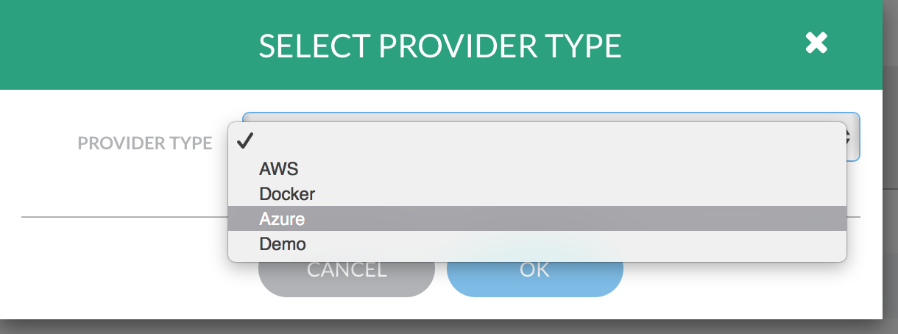
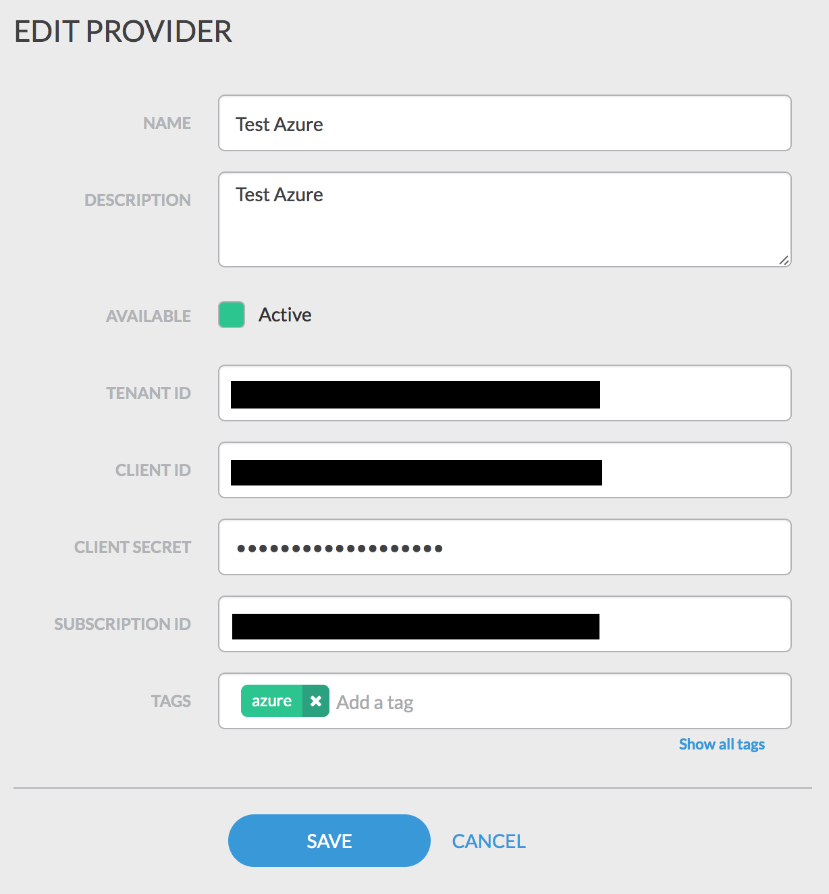

# jellyfish-azure

## Setup

The Jellyfish Azure module utilizes Azure's Resource Manager interface to manage resources such as Storage Accounts,
Virtual Machines, and Virtual Networks.  To perform this work, an Azure Subscription is used to allow an external
application to manage Azure Resources.

There will be 4 values to capture in this process. They will be used to connect Jellyfish to Azure:
- Subscription ID
- Tenant ID
- Client ID
- Client Secret

The first step us downloading and installing the [Azure CLI](https://azure.microsoft.com/en-us/documentation/articles/xplat-cli/).  Once the CLI is installed, the first step is getting the Subscription and Tenant IDs used when connecting Jellyfish to your Azure account.

```
$ azure account list 

info:    Executing command account list
data:    Name                             Id                                    Current  State
data:    -------------------------------  ------------------------------------  -------  -----
data:    Your subscription name           xxxxxxxx-xxxx-xxxx-xxxx-xxxxxxxxxxxx  true     n/a  
info:    account list command OK
```

Find the subscription you wish to use with Jellyfish and write down the **Subscription ID**.  Now use the Subscription ID to find the Tenant ID by requesting the details of the Subscription.

```
$ azure account show xxxxxxxx-xxxx-xxxx-xxxx-xxxxxxxxxxxx

info:    Executing command account show
data:    Name                        : Your subscription name
data:    ID                          : xxxxxxxx-xxxx-xxxx-xxxx-xxxxxxxxxxxx
data:    State                       : n/a
data:    Tenant ID                   : xxxxxxxx-xxxx-xxxx-xxxx-xxxxxxxxxxxx
data:    Is Default                  : true
data:    Environment                 : AzureCloud
data:    Has Certificate             : No
data:    Has Access Token            : Yes
data:    User name                   : user@domain.onmicrosoft.com
data:    
info:    account show command OK
```

Write down the **Tenant ID** for later use.  Next create the Active Directory application and service principal used to
manage access to the Azure API. Choose a password that will be your client key. You can aso choose a different name and URI is you like.

```
$ azure ad app create --name "Jellyfish Azure" --home-page http://jellyfish-azure -i http://jellyfish-azure --password
$PASSWORD

info:    Executing command ad app create
+ Creating application Jellyfish Azure                                                   
data:    Application Id:          d0da440c-67ad-4fd6-9806-fcd91721696c
data:    Application Object Id:   ecc9a510-8a6c-44cb-8b02-03e5ec82110f
data:    Application Permissions:  
data:                             claimValue:  user_impersonation
data:                             description:  Allow the application to access Jellyfish Azure on behalf of the signed-in user.
data:                             directAccessGrantTypes: 
data:                             displayName:  Access Jellyfish Azure
data:                             impersonationAccessGrantTypes:  impersonated=User, impersonator=Application
data:                             isDisabled: 
data:                             origin:  Application
data:                             permissionId:  c7f43a8d-da4c-446b-a740-62d802e11e40
data:                             resourceScopeType:  Personal
data:                             userConsentDescription:  Allow the application to access Jellyfish Azure on your behalf.
data:                             userConsentDisplayName:  Access Jellyfish Azure
data:                             lang: 
info:    ad app create command OK

$ azure ad sp create $APPLICATION_ID

info:    Executing command ad sp create
+ Creating service principal for application 5bbf2cdb-47c5-483f-8f98-12730c274f7d
data:    Object Id:               a4e5cc68-b2c9-4442-adaa-09bf27072938
data:    Display Name:            Jellyfish Azure
data:    Service Principal Names:
data:                             5bbf2cdb-47c5-483f-8f98-12730c274f7d
data:                             http://jellyfish-azure
info:    ad sp create command OK

```

Write down the Application ID as the **Client ID** and the password chosed as the **Client Secret**. The final step is
to give the new service principal permission to perform deployments.

```
$ azure role assignment create --objectId $SERVICE_PRINCIPAL_OBJECTID -o Contributor -c /subscriptions/$SUBSCRIPTION_ID/

info:    Executing command role assignment create
+ Finding role with specified name                                             
/data:    RoleAssignmentId     : /subscriptions/xxxxxxxx-xxxx-xxxx-xxxx-xxxxxxxxxxxx/providers/Microsoft.Authorization/roleAssignments/98cab6e5-2eec-4fbb-a631-3bfad10da661
data:    RoleDefinitionName   : Contributor
data:    RoleDefinitionId     : b24988ac-6180-42a0-ab88-20f7382dd24c
data:    Scope                : /subscriptions/xxxxxxxx-xxxx-xxxx-xxxx-xxxxxxxxxxxx
data:    Display Name         : Jellyfish Azure
data:    SignInName           :
data:    ObjectId             : a4e5cc68-b2c9-4442-adaa-09bf27072938
data:    ObjectType           : ServicePrincipal
data:    
+
info:    role assignment create command OK
```

## Creating a Azure Provider

To create a new Azure provider, click the **Providers** link in the **Admin** menu section to load the providers page.  Then click the **Add a Provider** button.  In the **Select Provider Type** dialog, choose the **Azure** product type and click **OK**.



Provide a name and description for the new provider, then set the Tenant ID, Client ID, Client Secret, and Subscription
ID to the values collected during the setup process.  The **Save** button will create the new provider.



TODO: navigate to providers

TODO: create new provider and choose Azure provider

TODO: enter values


## Creating a new public template product

## Creating a new private template product

### uploading to private storage

### creating the new product


